# Thunder ERP v2 - İş Akışları

## 1. Sipariş → Üretim → Teslim Akışı

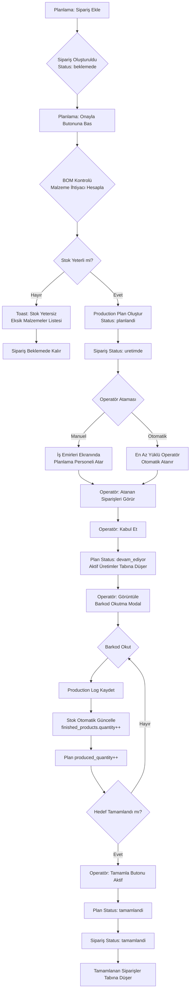

---

## 2. Stok Giriş/Çıkış Akışı

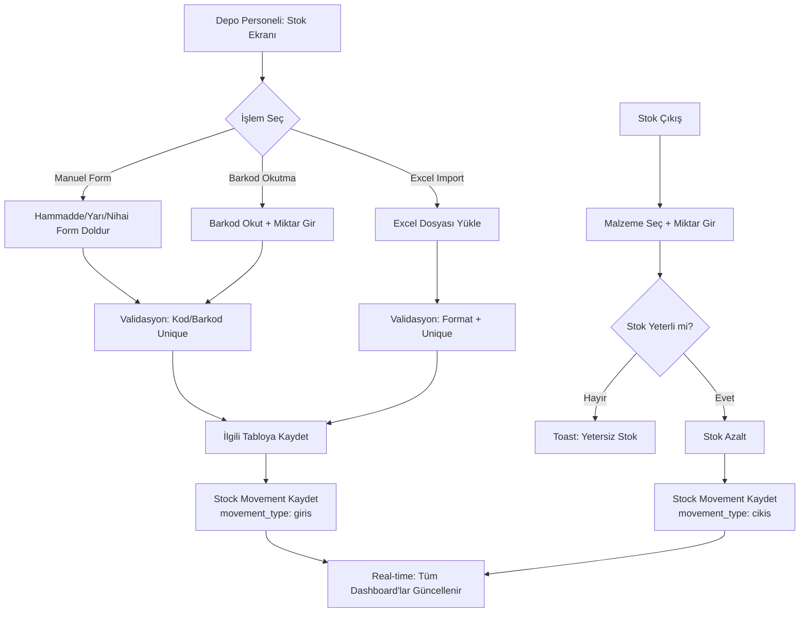

---

## 3. Envanter Sayım Akışı

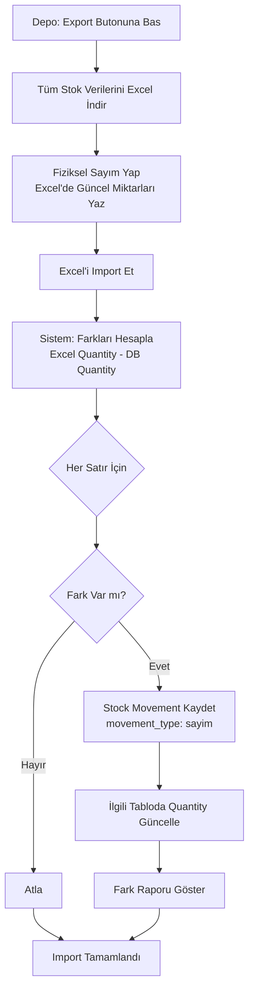

---

## 4. BOM (Ürün Ağacı) Yönetimi

```mermaid
flowchart TD
    A[Planlama: Ürün Ağacı Ekranı] --> B{Giriş Yöntemi}
    B -->|Manuel| C[Nihai Ürün Seç]
    B -->|Excel Import| D[Template Excel İndir]
    C --> E[Drag-Drop Görsel Ağaç]
    E --> F[Hammadde/Yarı Mamul Ekle<br/>Miktar Belirt]
    F --> G[BOM Kaydı Oluştur]
    D --> H[Excel Doldur:<br/>product_code | material_type | material_code | qty]
    H --> I[Excel Import Et]
    I --> J[Validasyon: Ürün/Malzeme Kodları Var mı?]
    J --> K[Toplu BOM Kayıtları Oluştur]
    G --> L[BOM Tamamlandı]
    K --> L
    L --> M[Sipariş Onayında Kullanılır]
```

---

## 5. Operatör Çoklu Üretim Akışı

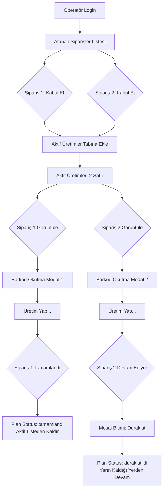

---

## 6. Fiyat Güncelleme & Yıllık Ortalama

```mermaid
flowchart TD
    A[Depo: Hammadde Düzenle] --> B[Birim Fiyat Güncelle<br/>50 TL → 55 TL]
    B --> C[Database Trigger Tetiklenir]
    C --> D[price_history Tablosuna Kayıt<br/>material_id, price: 55, effective_date: bugün]
    D --> E[raw_materials.unit_price Güncellenir]
    E --> F[Dashboard: Yıllık Ortalama Fiyat Göster<br/>SELECT AVG(price) FROM price_history<br/>WHERE effective_date >= CURRENT_DATE - 1 year]
    F --> G[Ortalama: 52.5 TL Gösterilir]
```

---

## 7. Authentication & RBAC

```mermaid
flowchart TD
    A[Kullanıcı: /login] --> B[Email + Şifre Gir]
    B --> C[POST /api/auth/login]
    C --> D{Bcrypt Şifre Kontrolü}
    D -->|Yanlış| E[401 Error: Invalid Credentials]
    D -->|Doğru| F[JWT Oluştur<br/>Payload: userId, role, exp: 7 days]
    F --> G[httpOnly Cookie Set:<br/>thunder_token=jwt]
    G --> H[Client: Redirect Based on Role]
    H --> I{Role?}
    I -->|yonetici| J[/dashboard Ana Sayfa]
    I -->|planlama| K[/dashboard/uretim]
    I -->|depo| L[/dashboard/stok]
    I -->|operator| M[/operator-dashboard]
    
    N[Her Sayfa İsteği] --> O[Middleware.ts: JWT Verify]
    O --> P{JWT Valid?}
    P -->|Hayır| Q[Redirect /login]
    P -->|Evet| R{Role Check}
    R -->|Unauthorized| S[403 Forbidden Page]
    R -->|Authorized| T[Sayfa Render]
```

---

## 8. Real-time Dashboard Güncellemesi

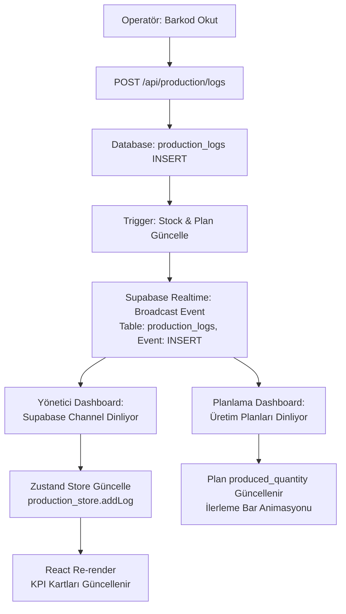

---

## State Machine Diyagramları

### Sipariş Status

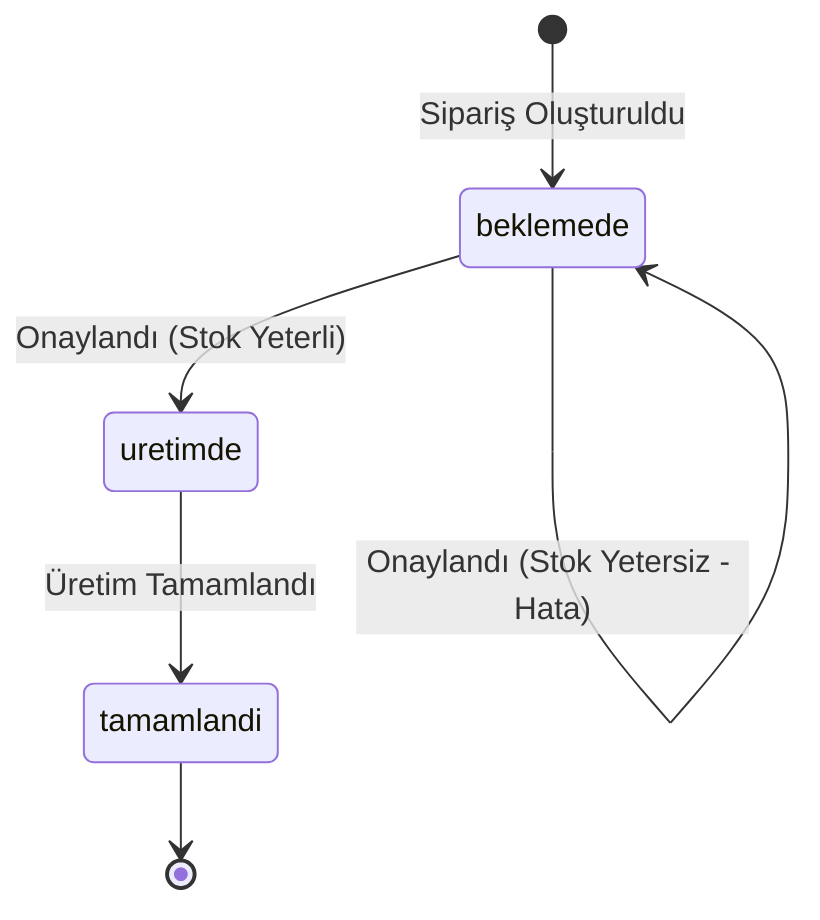

### Production Plan Status

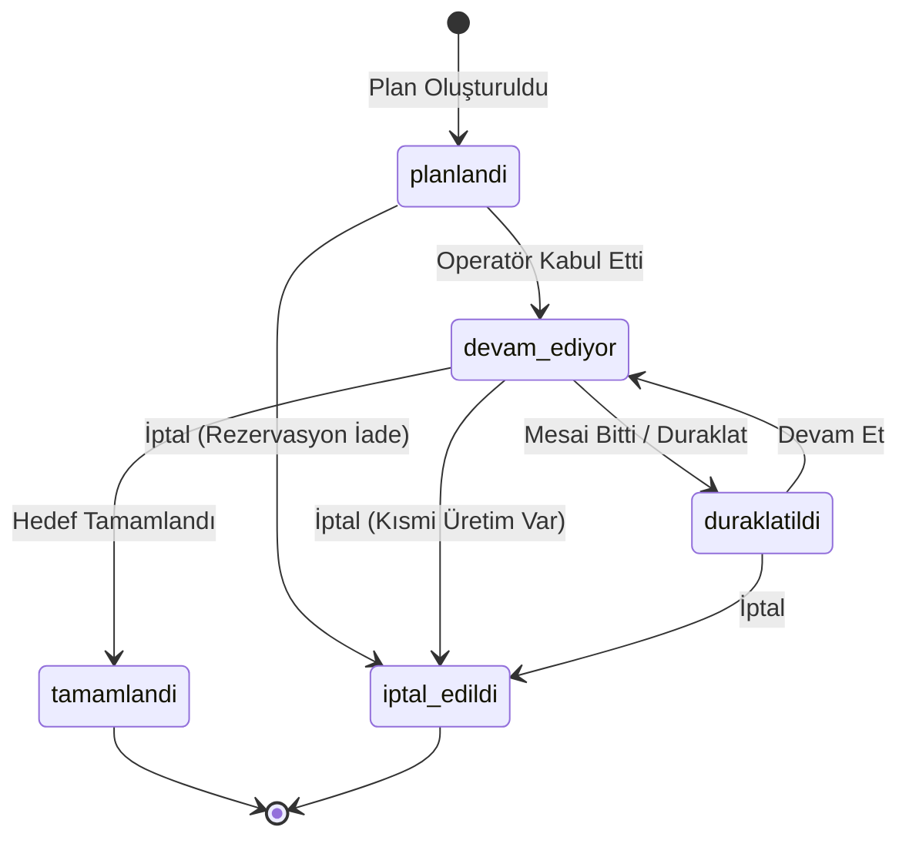

---

## 9. Hammadde/Yarı Mamul Otomatik Tüketim Akışı

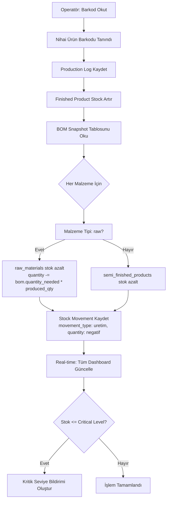

---

## 10. Hatalı Üretim Kaydı Geri Alma Akışı

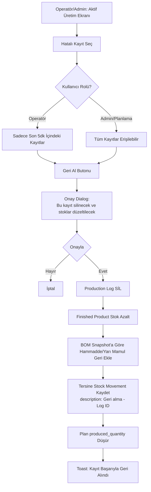

---

## 11. Sipariş Düzenleme/İptal Akışı (Durum Bazlı)

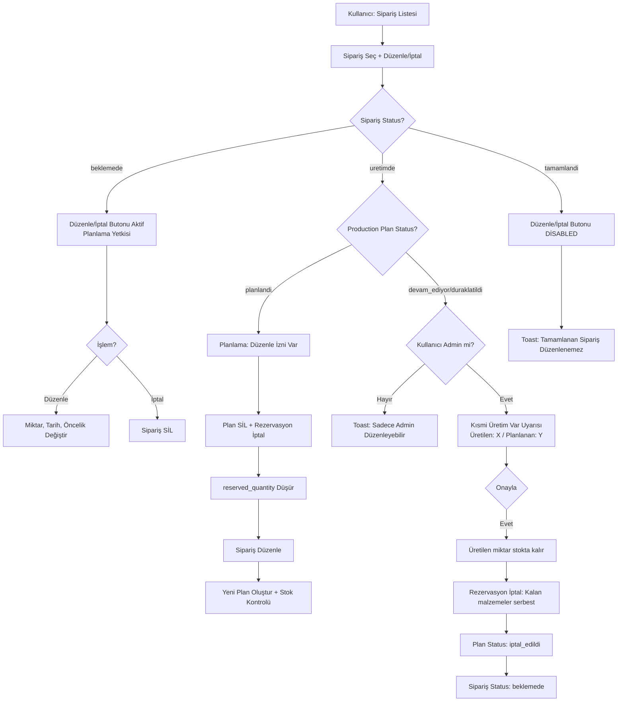

---

## 12. Malzeme Soft Rezervasyon Mekanizması

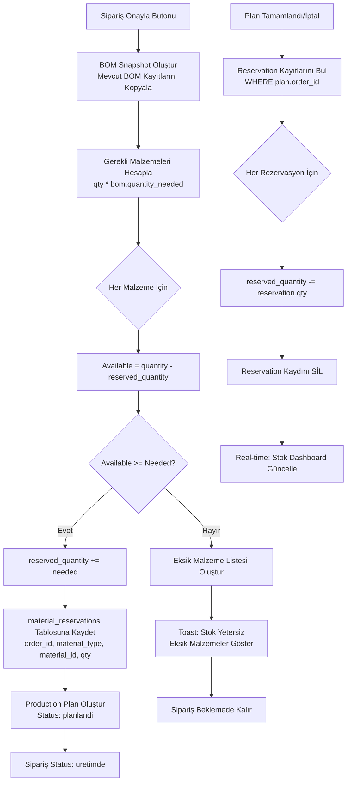

---

## 13. Üretim Planı İptal Akışı

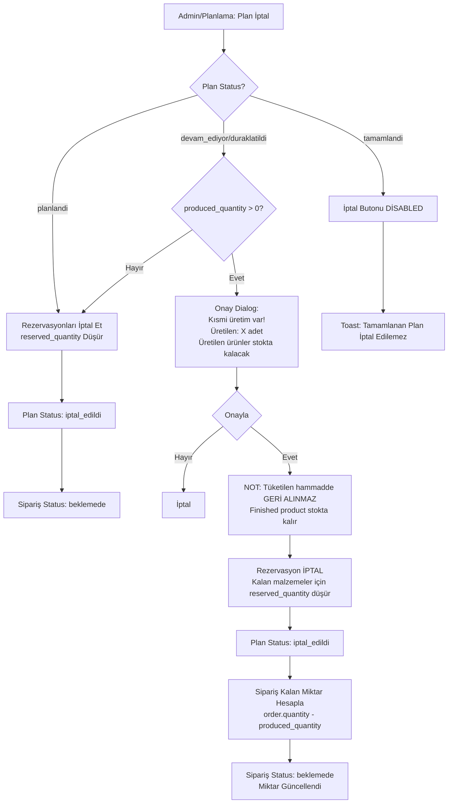

---

## 14. Stok Kritik Seviye Uyarı Sistemi

```mermaid
flowchart TD
    A[Stok Değişikliği<br/>Üretim/Giriş/Çıkış/Rezervasyon] --> B{quantity <= critical_level?}
    B -->|Hayır| C[Normal İşlem Devam]
    B -->|Evet| D[Notification Kayıt Oluştur]
    D --> E[type: critical_stock<br/>severity: high]
    E --> F[Planlama Rolündeki Tüm Kullanıcılara]
    F --> G[Dashboard: Kırmızı Badge + Bell Icon]
    G --> H[Bildirim İçeriği:<br/>Malzeme: [Kod - Ad]<br/>Mevcut: X<br/>Kritik Seviye: Y<br/>Fark: Z]
    
    I[Planlama: Bildirim Listesi Aç] --> J{Bildirim Seç}
    J --> K[Detayları Görüntüle]
    K --> L{İşlem?}
    L -->|Stok Gir| M[Stok Giriş Ekranına Yönlendir]
    L -->|Okundu İşaretle| N[is_read: TRUE]
    
    M --> O[Manuel Stok Girişi Yap]
    O --> P{quantity > critical_level?}
    P -->|Evet| Q[İlgili Bildirimi Otomatik Kapat<br/>is_read: TRUE]
    P -->|Hayır| R[Bildirim Aktif Kalır]
```

---

## 15. Kullanıcı Yönetimi Akışı

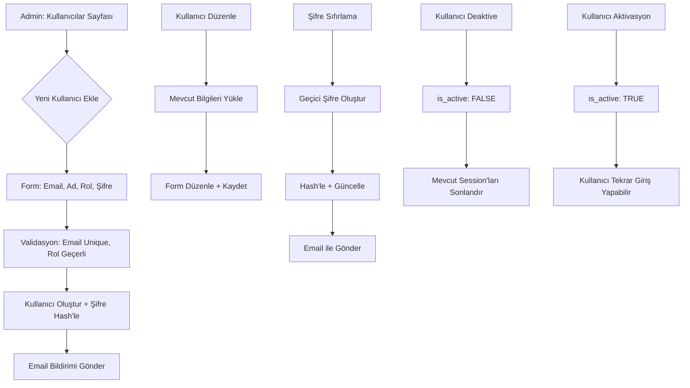

---

## 16. Sistem Ayarları Yönetimi Akışı

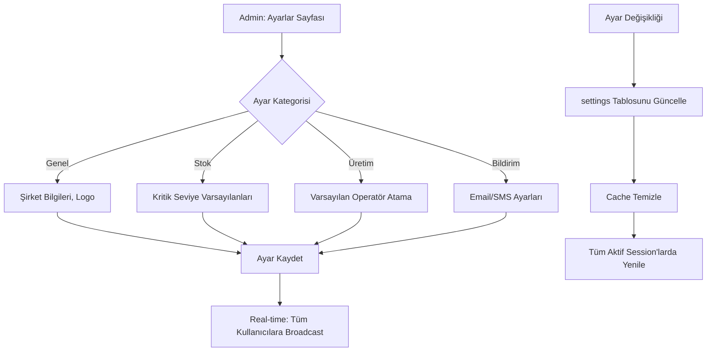

---

## 17. Raporlama & Analytics Akışı

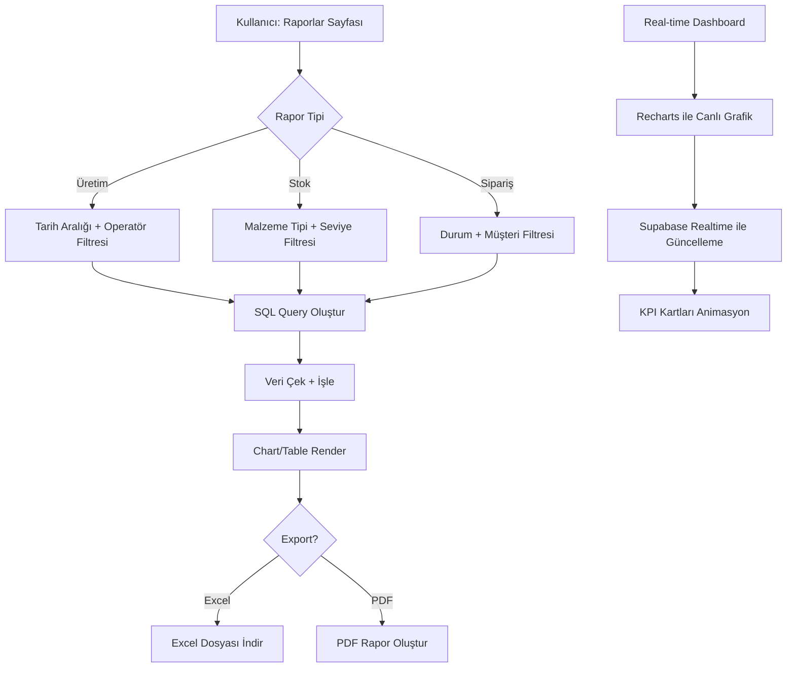

---

## 18. İşlem Geçmişi & Audit Log Akışı

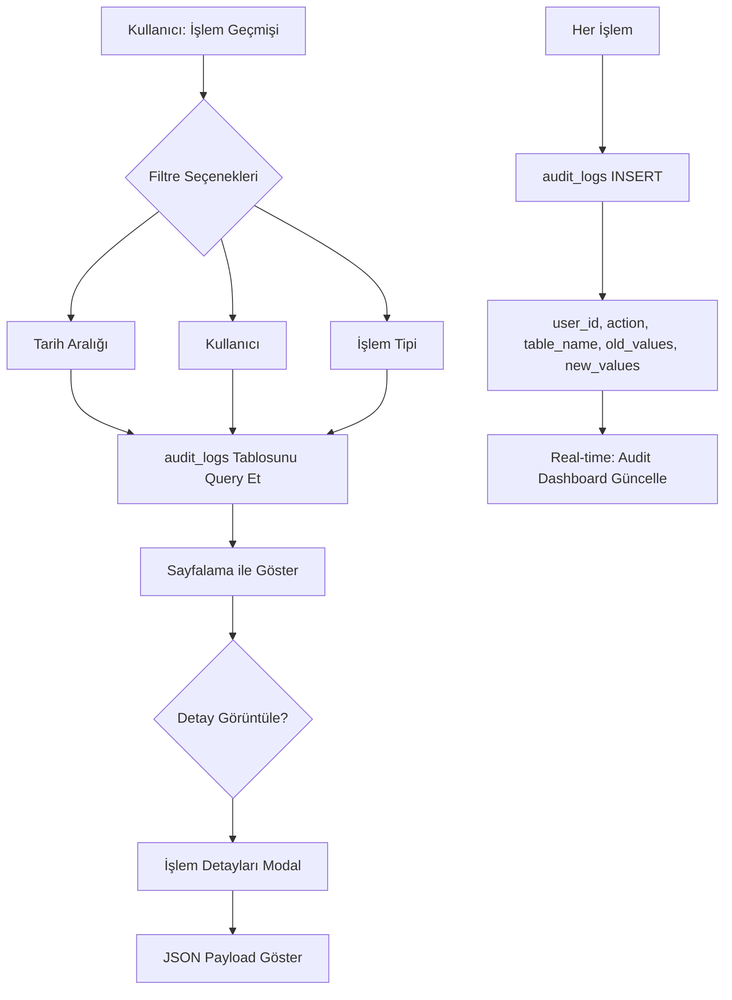

---

## 19. Bildirim Yönetimi Akışı

```mermaid
flowchart TD
    A[Kullanıcı: Bildirimler Sayfası] --> B[Bildirim Listesi]
    B --> C{Bildirim Seç}
    C --> D[Detayları Görüntüle]
    D --> E{İşlem?}
    E -->|Okundu İşaretle| F[is_read: TRUE]
    E -->|İlgili Sayfaya Git| G[URL'e Redirect]
    E -->|Tümünü Okundu İşaretle| H[Toplu Güncelleme]
    
    I[Yeni Bildirim Oluştu] --> J[Real-time Push]
    J --> K[Dashboard'da Badge Artır]
    K --> L[Bildirim Bell Icon'u Animasyon]
    
    M[Otomatik Bildirim] --> N{Kritik Seviye?}
    N -->|Evet| O[Planlama Rolüne Gönder]
    N -->|Hayır| P[İlgili Kullanıcılara Gönder]
```

---

## 20. Excel Import/Export Hata Yönetimi Akışı

```mermaid
flowchart TD
    A[Kullanıcı: Excel Import] --> B[Dosya Yükle]
    B --> C[Format Validasyonu]
    C --> D{Geçerli mi?}
    D -->|Hayır| E[Hata: Format Uyumsuz]
    D -->|Evet| F[Satır Satır İşle]
    F --> G{Her Satır}
    G --> H{Validasyon Geçti mi?}
    H -->|Hayır| I[Hatalı Satırları Listele]
    H -->|Evet| J[Veritabanına Kaydet]
    I --> K[Kullanıcıya Hata Raporu Göster]
    K --> L{Devam Et?}
    L -->|Evet| J
    L -->|Hayır| M[İşlemi İptal Et]
    
    N[Excel Export] --> O[Template Oluştur]
    O --> P[Veri Doldur]
    P --> Q[Dosya İndir]
```

---

## 21. Sistem Bakım & Temizlik Akışı

```mermaid
flowchart TD
    A[Admin: Sistem Bakımı] --> B{Bakım Tipi}
    B -->|Veri Temizliği| C[Eski Logları Sil]
    B -->|Performans| D[Index Optimizasyonu]
    B -->|Yedekleme| E[DB Backup Oluştur]
    C --> F[30+ günlük audit_logs sil]
    D --> G[VACUUM ANALYZE çalıştır]
    E --> H[PostgreSQL dump al]
    F --> I[Bakım Tamamlandı]
    G --> I
    H --> I
    
    J[Otomatik Bakım] --> K[Cron Job: Her Gece 02:00]
    K --> L[Log Temizliği + Optimizasyon]
    L --> M[Bakım Raporu Email Gönder]
```

---

## 22. Multi-tenant & Şirket Yönetimi Akışı (Gelecek için)

```mermaid
flowchart TD
    A[Super Admin: Şirket Yönetimi] --> B{Yeni Şirket Ekle}
    B --> C[Şirket Bilgileri + Database Schema]
    C --> D[Varsayılan Admin Kullanıcı Oluştur]
    D --> E[Şirket'e Özel Ayarlar]
    E --> F[Şirket Aktifleştir]
    
    G[Şirket Deaktive] --> H[Tüm Kullanıcıları Deaktive Et]
    H --> I[Veri Arşivle]
    I --> J[Şirket Pasif Duruma Geç]
    
    K[Şirket Düzenle] --> L[Şirket Bilgileri Güncelle]
    L --> M[Logo + Tema Ayarları]
    M --> N[Şirket Ayarlarını Kaydet]
```

